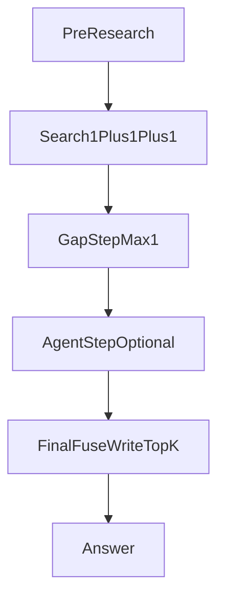
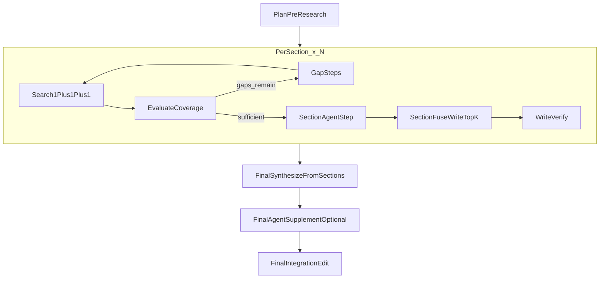

# Chat/Research 框架约束文档

本文档是项目级框架约束（Contract），用于约束 Chat 与 Deep Research 的核心工作流。  
除非同步更新本文件与对应 project rule，否则任何修改不得改变这里定义的主框架。

## 1. 目标与适用范围

- 统一 Chat 与 Research 的 step 语义与执行边界。
- 固化 `step_top_k` / `write_top_k` 职责，避免语义漂移。
- 固化放大池与取样策略（含 gap/agent 目标保护）。
- 说明最终综合（synthesize）与章节融合的边界，避免误把最终综合改造成“全量重做章节级融合”。

适用代码范围（含但不限于）：

- `src/api/routes_chat.py`
- `src/collaboration/research/agent.py`
- `src/retrieval/service.py`
- `src/llm/tools.py`
- `src/api/schemas.py`

## 2. 统一术语

- `pre-research`：预先结果获取 step。
- `1+1+1`：结构化主检索 step。
- `gap step`：补充检索 step。
- `agent step`：调用 agent 并允许补搜的 step。
- `step_top_k`：控制每个 step 实际获取的 chunk 数量上限（如 `1+1+1` / `gap` / `agent` 各自单步）。
- `write_top_k`：控制单个产出单元最终融合时，进入放大池并完成保护性取样后的输出上限。
- `放大池`：最终裁剪前，为保证全局排序质量而保留的候选池。
- `取样`：在最终融合里，根据目标保护与全局排序，从放大池选入 `write_top_k` 的过程。
- `产出单元`：Chat 一轮回答 / Research 一个章节。  
  （最终综合 synthesize 不属于产出单元，有独立规则）

## 3. TopK 与融合约束

### 3.1 step_top_k

- 只约束每个 step 的获取数量上限。
- 不直接定义最终放大池规模。
- 典型作用点：`1+1+1`、`gap`、`agent` 各步骤的检索输出。
- Chat 为缓解“step 数少导致候选池不足”，允许使用内部放大预算：
  - `chat_effective_step_k = ceil(step_top_k * 1.2)`
  - 该放大仅用于**候选召回/预筛**，不改变 `write_top_k` 的最终融合上限语义。
  - 若未命中充足候选，可自然回退，不做硬凑。

### 3.2 write_top_k

- 只用于 Chat 与 Research 的章节级最终融合上限。
- 最终融合流程：先组织放大池 -> 执行目标保护 -> 一次全局混合排序 -> 取 `write_top_k`。

## 4. 放大池与取样策略

### 4.1 放大池策略

- 不改变现有 local/web/provider 的召回与放大逻辑。
- 保持“先保留放大池，再全局排序，再截断”的模式。
- 放大池由各 step 的产出共同组成（主检索、gap、agent）。

### 4.2 取样策略

- 最终取样发生在产出单元对应的 final fuse。
- 使用一次全局相关性排序作为权威排序。
- 目标保护（非强制保底）：
  - `gap 20%`（目标占比）
  - `agent 10%`（目标占比）
- 仅当放大池中 `gap/agent` 候选充足时尽量满足目标占比。
- 若候选为空或不足，不硬性补位；剩余名额按相关性顺序补齐。
- 不引入额外分数加权。

## 5. Chat 规范流程

Chat 关键约束：

- `pre-research`、`1+1+1`、`gap`、`agent` 均是独立 step。
- 最终可见证据必须来自“主检索 + gap + agent”合并池，不能只依赖主检索池。
- `step_top_k` 仅约束各 step 获取数量；最终融合按 `write_top_k` 执行。
- Chat 内部可对 step 预算做 `1.2x` 候选放大（`ceil(step_top_k*1.2)`），用于提高放大池充足度；最终可见证据仍由 `write_top_k` 决定。
- final fuse 前允许保留放大池；final fuse 后按 `write_top_k` 取样。

## 6. Deep Research 规范流程

Research 关键约束：

- `plan` 背景检索属于全局 `pre-research`。
- 章节级主流程与 Chat 对齐：`1+1+1 -> gap×N -> agent -> section fuse(write_top_k)`。
- `step_top_k` 仅约束章节内各 step 的获取数量。
- `write_top_k` 仅约束章节级融合。

### 6.1 最终综合（synthesize）边界

- 最终综合不属于产出单元，不走 `write_top_k` 的章节级融合逻辑。
- 最终综合以“章节结果整合与微调”为主。
- 最多允许 final agent 做少量补充；其检索调用仍受 `step_top_k` 约束。
- 默认不重做此前章节级引文细节融合，沿用章节阶段形成的证据与引用结果。
- 最终综合阶段参考资料总量默认不设硬上限；若受输入预算影响，仅允许上下文压缩/编辑，不得改写为“全量原始证据再次 write_top_k 裁剪”。

## 7. DO NOT（不可破坏约束）

- 不得把 agent 补搜结果只放进 citation pool 而不进入最终 fuse。
- 不得把 `write_top_k` 退化为仅 `EvidenceSynthesizer` 截断。
- 不得把单次全局混合排序改成分池拼接后裁剪。
- 不得引入额外分数加权破坏“目标保护 + 相关性排序”。
- 不得将最终取样改成随机采样、均匀采样或按来源平均分桶采样。
- 不得在未更新本约束文档与 rule 的情况下改动放大池/召回策略基本形态。

## 8. 当前实现与目标差异（对齐清单）

- Chat 已有 `1+1+1` 与单轮 gap，但 agent 结果尚未重回最终融合上下文。
- Chat agent 工具检索尚未统一继承请求级 `step_top_k`。
- Research 章节检索当前仍以 tiered search 为主，尚未完全对齐章节统一 step 模型。
- 当前 `fuse_pools_with_gap_protection` 为 2 池模型（main + gap）；若要落地 agent 目标保护需扩展为 3 池（main + gap + agent）。
- Research `synthesize_node()` 当前未形成“章节结果整合 + 可选 agent 少量补充”的完整收敛模式。

## 9. 参考实现入口

- `src/api/routes_chat.py`
- `src/collaboration/research/agent.py`
- `src/retrieval/service.py`
- `src/llm/tools.py`
