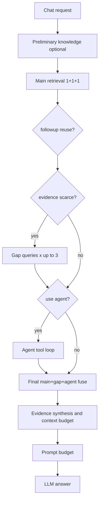
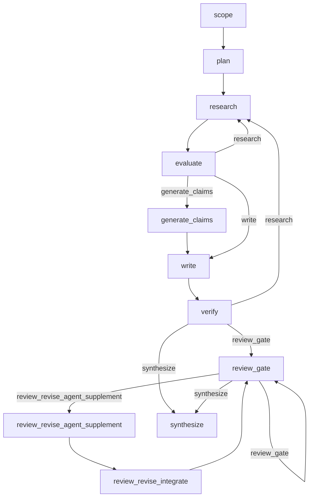
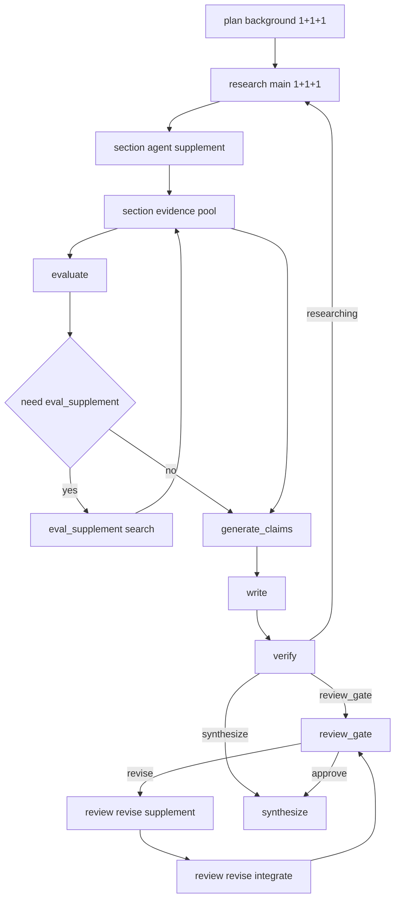

# Chat / Deep Research 预算与证据流转机制

本文档专门说明当前代码中的预算分配、证据流转、阶段选择与候选择优机制。  
本文件以当前实现为准，目标是让同事能够直接对照代码理解系统如何运行。

适用代码范围：

- `src/api/routes_chat.py`
- `src/collaboration/research/agent.py`
- `src/retrieval/service.py`
- `src/retrieval/structured_queries.py`
- `src/llm/tools.py`
- `config/settings.py`
- `config/rag_config.json`

## 1. 文档目标

本文档回答四个问题：

- 预算是怎么计算出来的，不再只看到零散的 `10`、`15`、`20`、`75`
- 检索出来的证据如何进入候选池、如何被阶段消费、如何被最终裁剪
- Chat 和 Deep Research 的阶段是如何跳转的
- 最终的“择优”到底靠什么规则完成

## 2. 共享原语

### 2.1 共享术语

- `step_top_k`：单次检索调用的输出上限
- `write_top_k`：单个产出单元写作前最终可消费的证据窗口
- `main pool`：主检索候选池
- `gap pool`：补缺检索候选池
- `agent pool`：agent 工具补搜候选池
- `放大池`：最终裁剪前的 rerank 池

### 2.2 共享三池融合公式

当前 Chat 和 Research 都使用 `fuse_pools_with_gap_protection(...)` 做三池融合，核心公式如下：

```text
n_total = n_main + n_gap + n_agent
target_top_k = min(max(top_k, 1), n_total)

rerank_k =
  min(
    max(ceil(target_top_k * rank_pool_multiplier), target_top_k + n_gap + n_agent),
    n_total
  )

gap_min_keep =
  显式传入 gap_min_keep
  或 ceil(target_top_k * gap_ratio)

agent_min_keep =
  显式传入 agent_min_keep
  或 ceil(target_top_k * agent_ratio)
```

融合顺序：

1. 合并 `main / gap / agent` 三个池
2. 做一次全局 rerank，得到权威排序，判断依据根据现阶段章节或者chat的问题等综合进行。
3. 先取 `target_top_k`
4. 若 `gap / agent` 配额不足，则从 ranked tail 和未入榜候选里回填
5. 优先替换掉输出中的低位 `main` 候选

这是一种“软配额 + 一次全局排序”的实现，不是多池分别排序后拼接。

### 2.3 当前代码里的共享现实

- `rank_pool_multiplier` 当前默认是 `3.0`
- `gap_ratio` 和 `agent_ratio` 在 Chat 与 Research 中不同
- 目前没有统一的 `budget_trace` 状态对象；预算分散在各节点内部计算

## 3. Chat：预算与证据流转

### 3.1 Chat 显式预算公式

Chat 的两个关键预算如下。

主检索 / gap 补搜 / agent 工具预算，由于chat的获取资料的轮数有限，我们做了一些放大，为了确保最终write_top_k的数量：

```text
chat_effective_step_top_k(step_k) =
  max(step_k, ceil(step_k * 1.2))
```

注意：

- 当 UI 传入 `step_top_k` 时，`_build_filters()` 会先做这层 `1.2x` 放大
- 当 UI 未传 `step_top_k` 时，主检索 fallback 使用 `local_top_k or 20`，再做同样的 `1.2x` 放大

写作证据窗口：

```text
chat_write_k =
  ui.write_top_k
  or ui.step_top_k
```

说明：`step_top_k` 本身已有合理兜底（未传时继承 `local_top_k`），不再额外硬编码 `or 15` 的魔法数字。Chat 当前没有单独的 `search_top_k_write_max` 逻辑。

### 3.2 Chat 候选池与融合参数

Chat 使用三池融合：

- `main pool`：主检索得到的 `pack.chunks`
- `gap pool`：gap query 补搜得到的 `gap_candidate_hits`
- `agent pool`：agent 工具返回的 `agent_extra_chunks`

当前参数：

- `chat_gap_ratio = 0.2`
- `chat_agent_ratio = 0.1`
- `chat_rank_pool_multiplier = 3.0`

因此最终 Chat 融合公式是：

```text
target_top_k = min(chat_write_k, n_total)
gap_min_keep = ceil(target_top_k * 0.2)
agent_min_keep = ceil(target_top_k * 0.1)
rerank_k = min(max(ceil(target_top_k * 3.0), target_top_k + n_gap + n_agent), n_total)
```

### 3.3 Chat 证据流转



### 3.4 Chat 阶段选择

Chat 当前的关键判断是：

- 是否需要 RAG
- 是否需要 follow-up reuse
- 是否 `evidence_scarce`
- 是否启用 agent

agent 决策当前代码逻辑：

```text
skip_assist_agent_for_sufficient_context =
  agent_mode == "assist"
  and query_needs_rag
  and do_retrieval
  and context_str 非空
  and not evidence_scarce

use_agent =
  agent_mode == "autonomous"
  or (agent_mode == "assist" and not skip_assist_agent_for_sufficient_context)
```

也就是说：

- `assist` 模式下，如果检索上下文已经足够，就不再启 agent
- `autonomous` 模式下，始终走 agent

### 3.5 Chat 的上下文预算

Chat 在检索完成后，还会经过两层上下文预算：

- 证据字符串预算：`_budget_chat_evidence_context(...)`
- 发给模型前的 prompt 预算：`_apply_pre_send_prompt_budget(...)`

当前字符阈值：

- `soft_max_chars = 40000`
- `soft_target_chars = 16000`
- `hard_max_chars = 55000`
- `system_hard_max_chars = 70000`

这部分属于“字符预算”，不是 `top_k` 预算，但会直接影响最终送给模型的上下文形态。

## 4. Deep Research：预算与证据流转

### 4.1 Research 主图



这张图严格对齐 `build_research_graph(...)` 的节点与边。

### 4.2 Research 的预算链

当前代码中的关键预算公式如下。

确认前背景检索预算：

```text
plan_top_k =
  ui.step_top_k
  or ui.local_top_k
  or 15
```

章节主检索预算：

```text
research_step_k =
  ui.step_top_k
  or preset.search_top_k
  or 20
```

评估 fallback 检索预算：

```text
eval_top_k =
  ui.step_top_k
  or preset.search_top_k_eval
```

写作总预算：

```text
preset_write_k = preset.search_top_k_write

effective_write_top_k_raw =
  if ui.write_top_k > 0:
    max(preset_write_k, ui.write_top_k)
  elif ui.step_top_k > 0:
    max(preset_write_k, floor(ui.step_top_k * 1.5))
  else:
    preset_write_k

effective_write_top_k =
  effective_write_top_k_raw
  # search_top_k_write_max 用于对有效写入 Top K 进行最终裁剪 (已接线)
```

当前代码里 `search_top_k_write_max` **已接线**，如果存在则进行 `min(effective_write_top_k_raw, max(search_top_k_write_max, preset_write_k))` 的 cap 逻辑。

写作验证预算：

```text
verification_k = max(15, ceil(effective_write_top_k * 0.25))
```

review/revise 补证预算：

```text
review_revise_base_k =
  ui.step_top_k
  or preset.search_top_k_eval

review_revise_supplement_k =
  max(1, ceil(review_revise_base_k * 0.5))
```

### 4.3 Research 候选池来源

Research 章节池当前会累积五类来源：

- `research_round`
- `eval_supplement`
- `agent_supplement`
- `write_stage`
- `revise_supplement`（review 返修阶段）

它们进入 fuse 时的池映射如下：

| 来源 | 进入哪个池 | 说明 |
|---|---|---|
| `research_round` | `main pool` | 主检索 |
| `write_stage` | `main pool` | write_node 兜底补搜（严禁回灌已用证据） |
| `eval_supplement` | `gap pool` | evaluate 补缺检索 |
| `agent_supplement` | `agent pool` | research_node 内部 agent 补搜 |
| `revise_supplement` | `agent pool` | review_revise_agent_supplement 定向补证（必须入池以保证引文溯源） |

### 4.4 Research 三池融合参数

当前 Research 的三池融合参数是：

- `research_gap_ratio = 0.2`
- `research_agent_ratio = 0.25`
- `research_rank_pool_multiplier = 3.0`

因此单章节 fuse 公式是：

```text
target_top_k = min(effective_write_top_k, n_total)
gap_min_keep = ceil(target_top_k * 0.2)
agent_min_keep = ceil(target_top_k * 0.25)
rerank_k = min(max(ceil(target_top_k * 3.0), target_top_k + n_gap + n_agent), n_total)
```

这意味着：

- `eval_supplement` 在当前实现里配额低于 agent
- `agent_supplement` 在当前实现里是更强的保留池

### 4.5 Research 证据流转



说明：

- `research_node()` 会执行主检索，然后立刻做一轮章节级 `agent_supplement`
- `evaluate_node()` 目标态：优先消费章节池已累积证据，若上下文过长仅允许压缩/摘要，不做小窗硬截断；只在池不足或为空时才 fallback 到检索（已落地）
- `eval_supplement` 触发后会把新证据继续回灌到章节池
- `write_node()` 和 `generate_claims_node()` 都从章节池取数

### 4.6 Research 阶段选择：`evaluate`

`evaluate` 之后是否继续 research，不是拍脑袋决定，而是按 guard 顺序判定。

当前 guard 顺序：

1. `force_synthesize == True`：直接转 `write`
2. `iteration_count >= max_iterations`：转 `write`
3. `section.research_rounds >= max_section_research_rounds`：转 `write`
4. `coverage_score >= coverage_threshold` 或 `section.gaps` 为空：转 `write` / `generate_claims`
5. coverage curve plateau：转 `write` / `generate_claims`
6. 否则：继续回到 `research`

其中写作前是否走 `generate_claims`，取决于：

```text
if skip_claim_generation or depth == "lite":
  next = "write"
else:
  next = "generate_claims"
```

### 4.7 Research 阶段选择：`verify`

当前 `verify` 的分流是：

- `light`：继续完成
- `medium`：记录 gaps，不回到 research
- `severe`：把章节状态改回 `researching`，由 `_after_verify()` 把图送回 `research`

verify severe 的回退上限：

```text
section.verify_rewrite_count += 1
if verify_rewrite_count > max_verify_rewrite_cycles:
  不再回 research
  改为 evidence_scarce，继续完成
```

### 4.8 Research 阶段选择：`review_gate`

`review_gate` 当前使用 runtime callback `review_waiter(section_title)` 判断每一章的审核状态。

分流规则：

- 全部 `approve`：转 `synthesize`
- 存在新的 `revise`：转 `review_revise_agent_supplement`
- 其他情况：留在 `review_gate`

注意：

- 当前代码并没有实现 `review_gate_*` 配置里的 polling/backoff/unchanged 逻辑
- 图上存在 `review_gate -> review_gate` 的自循环，但是否再次进入，取决于外部 waiter 是否返回新的审核结果

### 4.9 Review / Revise 当前现实

这里需要特别说明一个“名字和实现不完全一致”的现实：

- 节点名叫 `review_revise_agent_supplement`
- 但当前实现不是 tool-agent loop
- 它当前做的是一次 `retrieval.search(...)`

也就是说：

- 名称表达的是目标语义
- 当前代码行为仍然是“定向检索补证”

如果后续要把它补成真正的 agent/tool 补证，这一节应同步更新。

## 5. 预算如何被记录

当前实现中，预算是“显式计算、分散存放”的：

- Chat：
  - `write_k`
  - `filters.step_top_k`
  - `context budget diagnostics`
  - `pool_fusion diagnostics`
- Research：
  - `plan_top_k`
  - `research_step_k`
  - `eval_top_k`
  - `effective_write_top_k`
  - `verification_k`
  - `review_revise_supplement_k`

但当前仍然缺少一个统一的、可追溯的预算账本，例如：

```text
section_budget_trace = {
  "plan_top_k": ...,
  "research_step_k": ...,
  "eval_top_k": ...,
  "effective_write_top_k": ...,
  "verification_k": ...,
  "review_revise_supplement_k": ...,
  "gap_keep": ...,
  "agent_keep": ...,
  "rerank_k": ...,
}
```

这说明当前代码已经有“预算公式”，但还没有“统一预算台账”。

## 6. 当前最关键的实现现实

以下几项最容易被误解：

- `evaluate_node()` 目标态为“章节池优先 + 超长压缩”，不应做小窗再检索
- `review_revise_agent_supplement` 当前名称带 `agent`，但实现还是单次检索
- `verify_medium_threshold` 目前仍未进入实际分支判断
- `review_gate_*` 这组 polling/backoff 参数目前仍未真正驱动审核循环

## 7. 推荐阅读顺序

如果同事需要快速理解当前系统，建议按这个顺序阅读代码：

1. `src/retrieval/service.py`
2. `src/api/routes_chat.py`
3. `src/collaboration/research/agent.py`
4. `src/retrieval/structured_queries.py`

如果只看一处预算逻辑：

- Chat 看 `routes_chat.py`
- Research 看 `agent.py` 里的 `plan / research / evaluate / write / verify / review_revise`
