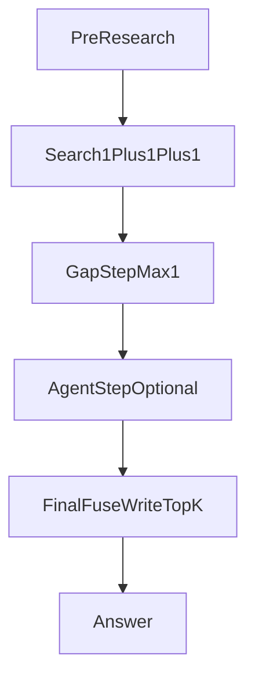
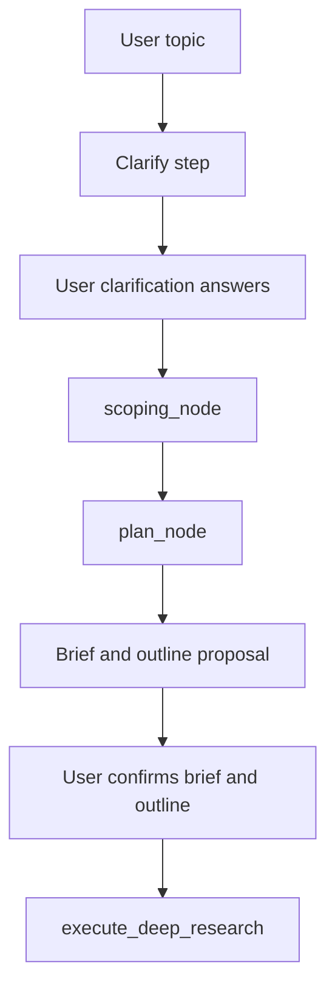
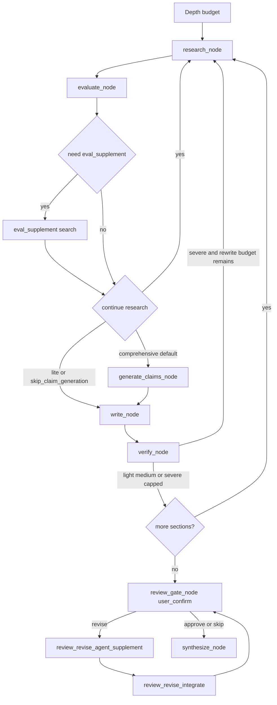

# Chat/Research 当前实现现状文档

本文档描述当前代码已经落地的真实行为，重点对齐 Chat 与 Deep Research 的实际工作流、数量边界和生效参数。  
本文件不是“目标态”设计稿，而是基于当前代码的现状快照；后续若代码变化，应同步更新本文档。

## 1. 适用范围

适用代码范围（含但不限于）：

- `src/api/routes_chat.py`
- `src/collaboration/research/agent.py`
- `src/retrieval/service.py`
- `src/retrieval/structured_queries.py`
- `src/llm/tools.py`
- `src/api/schemas.py`

## 2. 统一术语

本文件从这一节开始，优先使用当前代码里的真实名字。  
如果为了阅读需要给出更自然的中文名，也必须保留代码名，并明确两者对应关系。

### 2.1 主术语规则

- 在 Research 章节循环里：
  - 用 `section.gaps` 表示“章节缺口列表”
  - 用 `eval_supplement` 表示“系统补缺检索结果”
  - 用 `agent_supplement` 表示“章节 agent 补搜结果”
  - 用 `gap_supplement` 表示“用户提交的章节补充材料”
- 文档里不再用泛化的 `gap supplement` 同时指代多种对象。
- 若后续要做代码改名，必须同时给出“当前代码名 -> 目标命名”的映射。

### 2.2 术语映射表

| 当前代码名 | 本文统一称呼 | 类型 | 当前来源/作用 | 若后续要改名，建议目标名 |
|---|---|---|---|---|
| `section.gaps` | 章节 gaps 列表 | 状态字段 | `evaluate_node()` / `verify_node()` 产出的缺口文本列表 | `section_gap_list` |
| `eval_supplement` | 系统补缺检索结果 | 章节池 `pool_source` | `evaluate_node()` 触发的补检索结果；Research 中唯一 gap pool | `gap_supplement_search` |
| `agent_supplement` | 章节 agent 补搜结果 | 章节池 `pool_source` | `research_node()` 内部 agent 工具补搜结果；章节 fuse 的 agent pool | `section_agent_search` |
| `gap_supplement` | 用户补充材料 | API / DB / 事件名 | `/deep-research/jobs/{job_id}/gap-supplement` 提交；写作阶段读入，不参与章节 fuse pool | `user_gap_material` |
| `research_round` | 主研究证据 | 章节池 `pool_source` | `research_node()` 主检索得到的常规章节证据 | `main_research_round` |
| `write_stage` | 写作阶段兜底补搜 | 章节池 `pool_source` | `write_node()` 阶段因章节池证据不足或异常触发的兜底补充检索结果（严禁将已用过的写作/验证证据回灌） | `write_fallback_round` |
| `final_agent_supplement` | 最终综合 agent 补搜 | 运行期行为 | `synthesize_node()` 内部的最终综合 agent 补搜；不进入章节 fuse | `synthesis_agent_search` |
| `review_gate_node() -> research_node()` | 审核返修整章重跑 | 当前路径 | 当前代码里 `revise` 会让目标章节重新进入整章 research 循环 | `review_revise_agent_supplement -> review_revise_integrate` |
| `revise_supplement` | 返修补证证据 | 章节池 `pool_source` | `review_revise_agent_supplement` 获取的新证据入池标签；必须追加写入 Section Evidence Pool，保证 synthesize 阶段引文可精准溯源 | 保持不变 |
| `review_revise_agent_supplement` | 章节确认定向补证 | 目标节点 | 目标态下仅针对 review/revise 暴露的问题，做 1 轮 agent GAP 补证 | 保持不变 |
| `review_revise_integrate` | 章节确认整合重写 | 目标节点 | 目标态下将“现有章节文本 + 新证据 + 作者补充观点”直接整合成新版章节，并保留原有有效 `[ref:xxxx]` 占位 | `section_revise_merge` |
| `pre-research` | 前置研究 | 概念术语 | 确认前 prelim / clarify / scope / plan 的统称 | 保持不变 |
| `1+1+1` | 结构化主检索 | 概念术语 | `recall + precision + discovery` | 保持不变 |
| `step_top_k` | 单次检索上限 | 请求参数 | 主检索 / evaluate 取证 / agent 工具检索等单次调用上限 | 保持不变 |
| `write_top_k` | 写作证据上限 | 请求参数 | 章节写作或 claims 生成前最终取出的证据上限 | 保持不变 |

### 2.3 必须区分的三类 “补充”

- `eval_supplement`
  - 是系统自动触发的“补缺检索结果”
  - 来自 `evaluate_node()`
  - 会进入章节 fuse 的 gap pool
- `agent_supplement`
  - 是 agent 工具补搜出来的证据
  - 来自 `research_node()` 内部
  - 会进入章节 fuse 的 agent pool
- `gap_supplement`
  - 是用户手动提交的补充材料
  - 当前主要在 `write_node()` 作为高优先级上下文读入
  - 不进入章节 fuse 的 main/gap/agent pool
- `review_revise_agent_supplement`
  - 是 review / confirm 阶段的定向 agent 补证
  - 目标上只跑 `1` 轮
  - 不重开整章 `research_node()`
- `review_revise_integrate`
  - 是 review / confirm 阶段的定向整合重写
  - 输入应包含旧章节文本、新补证、作者补充观点、review 问题
  - 输出应尽量保留仍然有效的 `[ref:xxxx]` 占位

### 2.4 其他通用术语

- `放大池`：章节累积证据池，来源可包含 `research_round`、`eval_supplement`、`agent_supplement`、`write_stage`。
- `产出单元`：Chat 一轮回答 / Research 一个章节。

## 3. 当前生效的 TopK 语义

### 3.1 step_top_k

- Chat 中，`step_top_k` 约束主检索与 gap 补搜的单次输出上限。
- Research 中，`step_top_k` 约束每轮 `research_node()` 主检索输出上限。
- Research agent 工具检索会继承当前请求级 `step_top_k`。
- Research `evaluate_node()` 的取证窗口当前实际也是 `step_top_k` 优先；未传时回退到 preset `search_top_k_eval`（lite=20, comprehensive=40）。
- 当前主流程并没有按 depth preset 区分 `search_top_k_first` / `search_top_k_gap`。

### 3.2 write_top_k

- Chat 中，`write_top_k` 决定最终送入回答上下文的证据窗口。
- Research 中，`write_top_k` 决定章节写作前和 claims 生成前，从章节证据池中最终取出的证据数量。
- 当前实际计算规则：
  - 显式传入 `write_top_k` 时，取 `max(preset_write_k, ui_write_top_k)`。
  - 未传时，若有 `step_top_k`，取 `max(preset_write_k, floor(step_top_k * 1.5))`。
  - 未传 `step_top_k` 时，直接使用 depth preset 的 `search_top_k_write`。
- 当前代码没有对 `write_top_k` 施加 `search_top_k_write_max` 的硬 cap。

## 4. 当前放大池与保护性取样

### 4.1 Chat

- Chat 最终融合使用主检索、gap 补搜、agent 补搜三类候选共同组成的池。
- Chat 采用“候选池优先”语义：
  - local / web / gap / agent 各自先提供源内有序候选池
  - 只有在 `main + gap` 或 `main + gap + agent` 这种跨池边界，才执行权威 rerank
  - Chat 路径不再对 fused pool 追加绝对分数阈值过滤，避免配额保护后的候选再次被批量删除
- Chat 目标保护比例（软配额，候选不足时按全局排序补齐）：
  - **gap**：`chat_gap_ratio = 0.2`（20%），用于 gap 补搜融合与最终 main+gap+agent 融合。
  - **agent**：`chat_agent_ratio = 0.1`（10%），用于最终融合时 agent 池最低保留比例。
- 使用位置：
  - `src/api/routes_chat.py` 中 `_fuse_chat_main_gap_agent_candidates()`、gap 补搜后的 `fuse_pools_with_gap_protection()` 调用时传入 `gap_ratio=chat_gap_ratio`、`agent_ratio=chat_agent_ratio`（及 `gap_min_keep` / `agent_min_keep` 由同比例计算）。
- 配置：
  - `config` 的 `search.chat_gap_ratio`（默认 `0.2`）；`chat_agent_ratio` 若未在 `settings.search` 中配置，则代码 fallback 为 `0.1`。
- Chat fuse 放大倍率：`chat_rank_pool_multiplier = 3.0`（与 Research 的 `research_rank_pool_multiplier` 独立，均在对应路径的 `fuse_pools_with_gap_protection` 中传入）。

### 4.2 Deep Research（目标约束）

- Research 章节池当前会累积以下来源：
  - `research_round`
  - `eval_supplement`
  - `agent_supplement`
  - `write_stage`
- 其中凡是“结果会继续进入章节池、并在后续 `_rerank_section_pool_chunks()` 统一裁决”的检索，统一采用 `pool_only=True`：
  - `research_round`
  - `eval_supplement`
  - `review_revise_supplement`
- 例外：确认前背景检索 / 章节规划、evaluate fallback、write/verify fallback 这类“当前节点直接消费、不会先入章节池再统一 fuse”的检索，可保持 `pool_only=False`。
- 章节最终重排使用三池融合：
  - main pool：普通章节证据
  - gap pool：仅 `eval_supplement`
  - agent pool：仅 `agent_supplement`
- Research 目标保护比例：
  - `gap 20%`
  - `agent 25%`
- 保护是软配额，不是硬保底；候选不足时按全局排序补齐。
- Research 中“类似 Chat gap 概念”的只有 `eval_supplement`。
- Research 中的 `agent fuse` 确实存在，但范围要精确定义：
  - 只有 `research_node()` 里 agent 工具补出来并以 `pool_source=agent_supplement` 入池的 chunk，才会进入 agent pool
  - 这些 chunk 会在章节级 `_rerank_section_pool_chunks()` 中作为 `agent_candidates` 参与 fuse
  - 若当前章节没有 `agent_supplement`，则该轮 fuse 实际上只有 main pool + `eval_supplement` gap pool，没有 agent pool
- Research fuse 放大池目标定义为：
  - 基线放大倍率：`research_rank_pool_multiplier = 3.0`
  - 实际 `rerank_k = min(max(ceil(write_top_k * 3.0), write_top_k + n_gap + n_agent), n_total)`
  - 含义：先把 main/gap/agent 合并进放大池并做一次全局排序，再在该排序结果上执行 gap/agent 保护和最终裁剪。

## 5. Chat 当前流程

Chat 当前行为：

- 可选 pre-research / preliminary knowledge 预处理。
- 主检索使用 `1+1+1` 结构化查询。
- **Local 主检索**（`mode=local`）：dense + sparse 各自召回 → 应用层加权 RRF 融合 → 返回原始 RRF 候选池（**无 BGE rerank**）。web 模式各 provider 同样以 `pool_only=True` 形式返回原始候选，BGE rerank 统一延迟至最终融合步骤。
- 证据不足时最多生成 `1-3` 组 gap query，并行补搜；gap 子查询以 `pool_only=True` 返回原始候选池，**不在子查询内部做任何 rerank**，结果暂存为 `chat_gap_candidates_hits`。
- **单次最终 BGE rerank**（§5¾ 步骤，Phase `chat_pre_agent_fusion`）：在系统提示组装前，将 main pool（RRF 原始）+ gap pool（raw hits）送入 `_fuse_chat_main_gap_agent_candidates`，执行**全流程唯一一次**联合 BGE rerank，输出 `write_top_k` 条作为 `pack.chunks` 与 `context_str`。gap 保护比例 `chat_gap_ratio=0.2` 在此生效。
- Agent （可选）补搜结果：agent 在 §5¾ `context_str` 的基础上调用 LLM，LLM 通过工具检索产生 `agent_extra_chunks`（§5¾ 时不存在的新 chunks）。若 `agent_extra_chunks` 非空，再做**一次** agent 追加融合（`_fuse_chat_main_gap_agent_candidates`，`gap_candidate_hits=[]`，agent 受 `chat_agent_ratio=0.1` 保护）。两次 rerank 池组成不同，不冗余；`pack.chunks` 已含 gap，gap 不得重传。若 agent 未触发或工具无新 chunk，整条路径仅 1 次 BGE rerank。
- Chat 主检索在调用前会对 `step_top_k` 进行 1.2 倍软放大：`chat_effective_step_top_k = max(step_k, ceil(step_k * 1.2))`，目的是为 Main/Gap/Agent 三池融合提供充足的高质量候选缓冲。融合重排后再由 `write_top_k` 或原始 `step_top_k` 严格截断进入 LLM。

## 6. Deep Research 当前真实流程

### 6.1 确认前流程

确认前当前真实行为：

- 前端会先调用澄清问题接口，而不是直接进入 LangGraph 正式章节循环。
- `Clarify step` 当前会做两件事：
  - 可选调用 Perplexity / Sonar 生成 `preliminary_knowledge`
  - 基于 topic、history、preliminary knowledge 生成澄清问题
- 用户提交 `clarification_answers` 后，才进入 `scope + plan`。
- `scoping_node()` 会生成 `ResearchBrief`，核心包括：
  - `scope`
  - `success_criteria`
  - `key_questions`
  - `exclusions`
  - `time_range`
  - `source_priority`
  - `topic_domain`
- `plan_node()` 会先做一次确认前的背景检索：
  - 使用 `1+1+1` 结构化查询
  - `plan_top_k = step_top_k or local_top_k or 15`
  - 当前 plan phase 不使用 Sonar
- `plan_node()` 随后生成章节大纲，并把章节写入：
  - `dashboard.sections`
  - Canvas outline
- 用户确认后的 `confirmed_outline` / `confirmed_brief`，才会进入正式 `execute_deep_research()`。

### 6.2 章节循环流程

章节循环当前真实行为：

- 当前真实代码节点顺序是：
  - `research_node -> evaluate_node -> (generate_claims_node 可选) -> write_node -> verify_node`
- `research_node()` 内部当前做的不是 tiered 主流程，而是：
  - `1+1+1` 主检索
  - `agent_supplement`
  - 证据入 section pool
- `agent_supplement` 当前不是单独 LangGraph 节点，而是 `research_node()` 内部一步。
- `evaluate_node()` 当前先用 section pool 做取证评估，然后才判断是否需要 `eval_supplement`。
- `need eval_supplement` 的条件当前是：
  - `coverage_score < coverage_threshold`
  - 当前章节 pool chunk 数量 `< 5`
  - 存在 `section.gaps`
- 目标态下，`evaluate_node()` 优先消费当前章节池的已累积证据；若上下文过长，只允许压缩/摘要，不再对章节池做小窗硬截断。（已落地）
- 目标态下，只有章节池不足或为空时，`evaluate_node()` 才回退到 retrieval fallback。
- `eval_supplement search` 的目标规则是：
  - 最多取前 `3` 个 gaps
  - 每个 gap 单独检索一次，单次 `top_k = step_top_k`
  - 若 UI 未传 `step_top_k`，再回退到 preset `search_top_k_eval`
  - 检索结果以 `pool_source=eval_supplement` 进入章节池
  - 这些 `eval_supplement` 结果是 Research fuse 中唯一受 gap 保护的候选
- `generate_claims_node()`：
  - `comprehensive` 默认会执行
  - `lite` 默认跳过
  - `skip_claim_generation=true` 时也跳过
- 目标态下，`write_node()` 会从章节池重排后取 `write_top_k`，并额外取 `verification_k = max(15, ceil(write_top_k * 0.25))` 做写作时的二次验证上下文。
- `章节池重排` 当前确实会把 `agent_supplement` 单独作为 agent pool 传给 `fuse_pools_with_gap_protection()`。
- `verify_node()` 当前存在真实 `verify_rewrite -> research` 回路。
- 全部章节完成后：
  - 若 `skip_draft_review=false`，进入 `review_gate_node()`
  - 目标态下，若审核给出 `revise`，不再让目标章节回到整章 `research_node()`
  - 而是走：
    - `review_revise_agent_supplement`
    - `review_revise_integrate`
    - 然后带着新版章节再次回到 `review_gate_node()`，由用户确认“这轮补充是否已经落地”
  - 若审核通过或跳过审核，进入 `synthesize_node()`
- `review_revise_agent_supplement` 目标规则：
  - 只跑 `1` 轮 agent GAP 补证
  - 只针对当前 review 暴露的问题与缺口
  - 新补证窗口 `review_revise_supplement_k = max(1, ceil((step_top_k or search_top_k_eval) * 0.5))`
- `review_revise_integrate` 目标规则：
  - 不重跑整章 `research -> evaluate -> claims -> write`
  - 直接把“当前章节文本 + 新补证 + 作者补充观点 + review 问题”整合成新版章节
  - 旧章节里仍然成立的 `[ref:xxxx]` 应尽量保留；仅在新增或改写位置补新引用
  - 输出新版章节后，必须再次进入 `review_gate_node()`，等待用户确认补充是否落地
  - 目标提示词思路：
    - 你正在修订已有章节
    - 原章节文本如下
    - 针对不足新获取的证据如下
    - 作者补充观点如下
    - 请输出新的章节版本，保留仍然有效的引用占位，并回答提出的不足/问题

从本节开始，以下数量规则以“后续代码改造目标”为准；若与当前实现不一致，应以后述规则为准进行代码调整。

### 6.3 目标：Research中每一步保留数量与 UI 参数关系

| 阶段 | 目标数量规则 | 与 UI `step_top_k` 的关系 | 与 UI `write_top_k` 的关系 |
|---|---|---|---|
| Clarify prelim | 无固定 top_k | 无直接关系 | 无 |
| `plan_node()` 背景检索 | `plan_top_k = step_top_k or local_top_k or 15` | 直接继承；未传则回退到 `local_top_k`，再回退 `15` | 无 |
| `research_node()` 主检索 | `top_k = step_top_k or 20` | 直接继承；未传则回退 `20` | 无 |
| `research_node()` agent tools | 每次工具检索继承请求级 `step_top_k` | 直接继承 | 无 |
| `evaluate_node()` 取证 | 优先使用当前章节池的已累积证据；不再按 `eval_top_k` 对章节池做二次硬截断；若上下文过长，仅允许压缩/摘要；若章节池不足或为空，才 fallback retrieval | 无直接关系；仅当章节池不足或为空触发 fallback retrieval 时，fallback 检索窗口可继承 `step_top_k` | 无 |
| `eval_supplement` 每 gap | `top_k = step_top_k`；最多取前 `3` 个 gaps；若 UI 未传则回退到 preset `search_top_k_eval` | 直接继承；未传时回退到 preset 的 `search_top_k_eval` | 无 |
| `generate_claims_node()` 取证 | `effective_write_top_k` | 若没传 `write_top_k`，会间接受 `step_top_k` 影响 | 直接参与计算 |
| `write_node()` 主写作证据 | `effective_write_top_k`；但初稿写作与章节验证的 prompt packing 不能占满窗口，必须为后续章节确认补证与问题整合预留上下文余量 | 若没传 `write_top_k`，会间接受 `step_top_k` 影响；`step_top_k` 越大，后续应预留的 revise 补证余量也随之增大 | 直接参与计算 |
| `write_node()` verification context | `verification_k = max(15, ceil(write_top_k * 0.25))` | 无直接关系 | 直接参与计算 |
| `review_revise_agent_supplement` | `review_revise_supplement_k = max(1, ceil((step_top_k or preset.search_top_k_eval) * 0.5))`；每次 review / confirm 只允许 `1` 轮定向 agent GAP 补证 | 直接继承 `0.5 x step_top_k`；未传时回退到 `0.5 x preset.search_top_k_eval` | 无 |
| `review_revise_integrate` | 不重新跑 full research fuse；直接消费“旧章节文本 + review 问题 + 作者补充观点 + 新补证”生成新版章节，并保留原有有效 `[ref:xxxx]`；输出后必须再次回到 `review_gate_node()` 供用户确认 | 新补证部分间接受 `step_top_k` 影响，因为其输入来自 `review_revise_supplement_k` | 无直接关系；原则上不重新展开一次完整 `write_top_k` 取证 |
| `synthesize_node()` final agent tools | 综合主体直接使用章节写作结果、章节级摘要、聚合后的 `open_gaps` / `conflict_notes`，并保留可反查的 `[ref:xxxx]` 占位；不再统一导入所有原始材料；仅 final agent supplement 做少量补搜 | 只有触发 final agent supplement 时才继承 `step_top_k` | 无 |

`effective_write_top_k` 目标公式：

- 若 UI 显式传 `write_top_k > 0`：
  - `effective_write_top_k = max(preset_write_k, ui_write_top_k)`
- 否则若 UI 显式传 `step_top_k > 0`：
  - `effective_write_top_k = max(preset_write_k, floor(step_top_k * 1.5))`
- 否则：
  - `effective_write_top_k = preset_write_k`

`verification_k` 目标公式：

- `verification_k = max(15, ceil(write_top_k * 0.25))`

`review_revise_supplement_k` 目标公式：

- `review_revise_supplement_k = max(1, ceil((step_top_k or preset.search_top_k_eval) * 0.5))`

补充说明：

- `search_top_k_write_max` 若继续保留，应作为 `effective_write_top_k` 的最终 cap 明确接入。
- `evaluate_node()` 的目标是“章节池优先 + 超长压缩”，而不是把已累积证据再次做小窗截断。
- `write_node()` / `verify_node()` / `generate_claims_node()` 的 prompt packing 不能把章节上下文窗口压满，必须为 `review_revise_agent_supplement` 的新增证据和 review 问题整合留出余量。

### 6.4 流程图中的数字与预算目标

- `Depth budget` 目标对应：

| 项目 | lite | comprehensive | 说明 |
|---|---:|---:|---|
| 每章 research 上限 | 3 | 5 | `max_section_research_rounds` |
| 每章 verify rewrite 上限 | 1 | 2 | `max_verify_rewrite_cycles` |
| 全局 `max_iterations` | `4 x N_sections` | `7 x N_sections` | `(research_rounds + rewrite_cycles) x num_sections` |
| `write_top_k` 基线 | 10 | 12 | `search_top_k_write` |
| `verification_k` | 默认 `15`，随 `write_top_k` 上升 | 默认 `15`，随 `write_top_k` 上升 | `max(15, ceil(write_top_k * 0.25))` |
| `review_revise_supplement_k` | 默认 `10`，随 `step_top_k` 上升 | 默认 `20`，随 `step_top_k` 上升 | `max(1, ceil((step_top_k or search_top_k_eval) * 0.5))` |
| 章节 fuse gap 比例 | 20% | 20% | 仅 `eval_supplement` 参与 |
| 章节 fuse agent 比例 | 25% | 25% | 仅 `agent_supplement` 参与 |
| 章节 fuse 放大倍率 | 3.0 | 3.0 | `research_rank_pool_multiplier` |

补充说明：

- `global max_iterations` 在所有章节首轮完成后会被重置一次，用于后续 refine / supplement 阶段继续运行。
- `review_gate` 不消耗 `max_section_research_rounds`，但会继续消耗 graph steps。
- `章节 fuse gap 比例` 这里明确指：只有 `pool_source=eval_supplement` 的候选算 gap pool。
- `章节 fuse agent 比例` 这里明确指：只有 `pool_source=agent_supplement` 的候选算 agent pool。
- `章节 fuse 放大倍率` 指先把候选放大到 rerank pool，再做一次全局排序和软保护裁剪。
- `verification_k` 不再是 depth preset 固定值，而是写作窗口驱动的动态值。
- `review_revise_supplement_k` 是 review / confirm 阶段的定向补证窗口，不应通过重开整章 `research_node()` 来替代。

### 6.5 Verify 当前真实分流

当前 verify 不是抽象的“验证后决定是否继续”，而是有明确的三类后果：

- `light`：
  - unsupported ratio `<= verify_light_threshold`
  - 只发轻量告警，章节继续完成
- `medium`：
  - unsupported ratio `> verify_light_threshold` 且 `<= verify_severe_threshold`
  - 记录 gaps / supplementary queries，不回到 research
- `severe`：
  - unsupported ratio `> verify_severe_threshold`
  - 章节回到 `research`
  - 若超过 `max_verify_rewrite_cycles`，则 severe 被 cap，章节不再重开 research，而是继续完成

补充说明：

- preset 里虽然存在 `verify_medium_threshold`，但当前实际分支判断并没有使用它；当前代码真正用于控制 verify 分流的是 `verify_light_threshold` 和 `verify_severe_threshold`。

## 7. Research 中当前真正生效的关键参数与数量边界

### 7.1 当前真正生效的 depth 参数

| 参数 | lite | comprehensive | 当前状态 | 说明 |
|---|---:|---:|---|---|
| `max_section_research_rounds` | 3 | 5 | 生效 | 每章最多 research 轮次 |
| `max_verify_rewrite_cycles` | 1 | 2 | 生效 | verify severe 最多打回次数 |
| `coverage_threshold` | 0.60 | 0.80 | 生效 | evaluate 达标阈值 |
| `search_top_k_write` | 10 | 12 | 生效 | 无 UI 覆盖时 write_top_k 基线 |
| `verification_k` | 12 | 16 | 生效 | 写作阶段二次验证窗口 |
| `verify_light_threshold` | 0.20 | 0.15 | 生效 | verify 轻微阈值 |
| `verify_medium_threshold` | 0.40 | 0.30 | 已配置但未参与分支 | 当前代码未实际使用 |
| `verify_severe_threshold` | 0.45 | 0.35 | 生效 | verify severe 回退阈值 |
| `recursion_limit` | 200 | 500 | 生效 | LangGraph recursion limit |
| `cost_warn_steps` | 120 | 300 | 生效 | 成本预警步数 |
| `cost_force_summary_steps` | 180 | 420 | 生效 | 强制收敛步数 |
| `cost_tick_interval` | 25 | 30 | 生效 | 心跳上报间隔 |
| `generate_claims` | 跳过 | 默认启用 | 生效 | 非 preset 字段，而是 depth 分支行为 |

### 7.2 1+1+1 查询生成

- 当前主流程的 `1+1+1` 固定生成：
  - `1 recall`
  - `1 precision`
  - `1 discovery`
- 若用户 query 为中文，Google / Google Scholar 额外可带 `1 precision_zh`。
- 这部分当前不随 `lite` / `comprehensive` 改变；两个 depth 在主流程里都是同一套 `1+1+1`。

### 7.3 Research 主检索输出数量

- 每轮主检索实际使用：
  - `top_k = step_top_k`，若请求未传则回退到 `20`
- 当前主流程没有使用 `search_top_k_first=18/30` 这组 depth preset 数值。

### 7.4 `evaluate_node()` / `eval_supplement` 目标数量规则

- `evaluate_node()` 的目标语义：
  - 优先使用当前章节池的已累积证据
  - 不再按 `eval_top_k` 对章节池做二次硬截断
  - 若章节池上下文过长，只允许压缩/摘要
  - 只有章节池不足或为空时，才 fallback 到 retrieval
- `evaluate_node()` fallback retrieval 的目标规则：
  - `eval_top_k = step_top_k`，若请求未传则回退到 preset 的 `search_top_k_eval`
  - 默认 fallback 值是：
    - `lite = 20`
    - `comprehensive = 40`
- 当触发 `eval_supplement` 时，目标规则是：
  - 最多取前 `3` 个 gaps
  - 每个 gap 的检索 `top_k = step_top_k`
  - 若请求未传 `step_top_k`，则回退到 preset 的 `search_top_k_eval`
- 因而目标范围是：
  - `lite` 未传 `step_top_k`：每 gap `20` 条，最多约 `60` 条补充 chunk
  - `comprehensive` 未传 `step_top_k`：每 gap `40` 条，最多约 `120` 条补充 chunk
  - `step_top_k = 30`：每 gap `30` 条，最多约 `90` 条
  - `step_top_k = 50`：每 gap `50` 条，最多约 `150` 条
- 这组放大是有意的，依赖后续章节 fuse 放大池和保护性裁剪来收敛，而不是在 `eval_supplement` 阶段提前压得过小。

### 7.5 `write_top_k` / `verification_k` 目标规则

目标规则如下：

| 参数 | lite | comprehensive | 目标说明 |
|---|---:|---:|---|
| `max_section_research_rounds` | 3 | 5 | 保持不变 |
| `max_verify_rewrite_cycles` | 1 | 2 | 保持不变 |
| `coverage_threshold` | 0.60 | 0.80 | 保持不变 |
| `search_top_k_write` | 10 | 12 | 作为 `write_top_k` 基线保留 |
| `verification_k` | 默认 `15`，随 `write_top_k` 上升 | 默认 `15`，随 `write_top_k` 上升 | 改为 `max(15, ceil(write_top_k * 0.25))` |
| `generate_claims` | 跳过 | 默认启用 | 保持不变 |

补充说明：

- 若未传 `step_top_k` / `write_top_k`：
  - `lite write_top_k = 10`
  - `comprehensive write_top_k = 12`
  - 因此两者默认 `verification_k` 都会先落到 `15`
- 若 `step_top_k = 50` 且未显式传 `write_top_k`：
  - `write_top_k = 75`
  - 目标 `verification_k = max(15, ceil(75 * 0.25)) = 19`
- `verification_k` 改成动态值之后，不再保留 `lite=12 / comprehensive=16` 这组固定 preset 语义。
- 章节初稿相关节点不能把可用上下文压满，应为后续 review / confirm 阶段至少预留：
  - review 问题与作者补充观点的整合空间
  - `review_revise_supplement_k` 对应的新证据空间

### 7.6 Review / Confirm 阶段的目标补证与整合规则

- 当 `review_gate_node()` 给出 `revise` 时，目标回路不是“整章重跑”。
- 目标回路应改为：
  - `review_revise_agent_supplement`
  - `review_revise_integrate`
  - 回到 `review_gate_node()` 由用户再次确认
- `review_gate_node()` 在这条返修支路里是必须回访的确认闸门，不能被内部自动通过替代。
- `review_revise_agent_supplement` 目标规则：
  - 仅跑 `1` 轮 agent GAP 补证
  - 仅补当前 review 指出的缺口
  - `review_revise_supplement_k = max(1, ceil((step_top_k or search_top_k_eval) * 0.5))`
  - **架构铁律**：获取的新证据除参与当前整合重写外，必须追加写入当前章节的 Section Evidence Pool（使用 `pool_source="revise_supplement"` 标签），以保证最终全文合成阶段引文可精准溯源
- `review_revise_integrate` 目标规则：
  - 直接消费旧章节文本、新补证、review 问题、作者补充观点
  - 输出新的章节版本
  - 输出后必须再次展示给用户，并回到 `review_gate_node()` 判断这轮补充是否真正落地
  - 仍然有效的旧 `[ref:xxxx]` 引用占位应尽量保留
  - 新增内容或被改写内容再补新引用
- 目标提示词结构建议包含：
  - 原章节文本
  - 针对不足新获取的证据
  - 作者补充观点
  - review 提出的问题/不足
  - 明确要求输出“新的章节版本”，而不是补丁式片段

### 7.7 Verify rewrite / 章节回退数量边界

- `lite`：
  - 每章 research 最多 `3` 轮
  - verify severe 最多打回 `1` 次
  - 因而单章节理论上最多经历 `3` 次 research round + `1` 次 verify rewrite back
- `comprehensive`：
  - 每章 research 最多 `5` 轮
  - verify severe 最多打回 `2` 次
  - 因而单章节理论上最多经历 `5` 次 research round + `2` 次 verify rewrite back

说明：

- 这里的上限是控制逻辑层面的上限，不等于一定会走满。
- 真正回退到 research 的前提，是 verify 进入 severe 分支且未超过 rewrite cap。

### 7.8 全局迭代预算

- 当前实际全局预算不是 `max_iterations_per_section × num_sections`。
- 当前使用公式：
  - `max_iterations = (max_section_research_rounds + max_verify_rewrite_cycles) × num_sections`
- 因此：
  - `lite = (3 + 1) × num_sections = 4 × num_sections`
  - `comprehensive = (5 + 2) × num_sections = 7 × num_sections`

### 7.9 章节 fuse 的目标保护参数

- 章节写作前的 pool rerank 目标使用：
  - `research_gap_ratio = 0.2`（章节 fuse gap 比例 20%）
  - `research_agent_ratio = 0.25`（章节 fuse agent 比例 25%）
  - `research_rank_pool_multiplier = 3.0`
- 其中：
  - 只有 `eval_supplement` 进入 gap pool
  - `agent_supplement` 进入 agent pool
  - `research_round` / `write_stage` 进入 main pool
- fuse 放大池目标明确写为：
  - `rerank_k = min(max(ceil(write_top_k * research_rank_pool_multiplier), write_top_k + n_gap + n_agent), n_total)`
  - 默认 `research_rank_pool_multiplier = 3.0`
- 因而默认情况下（软目标，非硬保底）：
  - `lite write_top_k = 10` 时，目标约 `gap 2`、`agent 2～3`
  - `comprehensive write_top_k = 12` 时，目标约 `gap 2`、`agent 3`
- 当前实现与本文档一致：`research_gap_ratio = 0.2`、`research_agent_ratio = 0.25`。

### 7.10 当前真正生效的成本与收敛参数

| 参数 | lite | comprehensive | 当前状态 | 说明 |
|---|---:|---:|---|---|
| `cost_warn_steps` | 120 | 300 | 生效 | 超过后发成本预警 |
| `cost_force_summary_steps` | 180 | 420 | 生效 | 超过后设置 `force_synthesize` |
| `cost_tick_interval` | 25 | 30 | 生效 | 每隔 N 步发一次 tick |
| `recursion_limit` | 200 | 500 | 生效 | 编译后写入 graph recursion limit |

## 8. 当前未接线或仅部分接线的 preset 字段

以下字段目前在配置或文档中出现，但不驱动当前 Research 主路径（如果确认这些参数不使用，建议后续清除）：

- `max_iterations_per_section`
- `search_top_k_first`
- `search_top_k_gap`
- `self_correction_trigger_coverage`
- `self_correction_min_round`
- `search_top_k_gap_decay_factor`
- `search_top_k_gap_min`
- `recall_queries_per_section` / `precision_queries_per_section` 的主流程数量差异
- `round1_max_tier` / `gapfill_max_tier` / `last_round_max_tier`
- `tier3_refined_queries`（仅 `optimize_section_evidence()` 路径使用）
- `review_gate_max_rounds`
- `review_gate_base_sleep`
- `review_gate_max_sleep`
- `review_gate_early_stop_unchanged`
- `search_top_k_write_max`
- `verify_medium_threshold`

说明：

- `search_top_k_eval` 不是完全未接线：
  - 当请求未传 `step_top_k` 时，它会作为 evaluate fallback 生效。
  - 但它并不主导当前主流程的“分 depth 检索策略”。
- `review_gate_*` 当前虽然存在于 preset，但代码没有实现 polling / exponential backoff / unchanged early-stop 这套逻辑；当前 review gate 是单次检查后直接 `interrupt`。
- `search_top_k_write_max` 当前没有进入 `_compute_effective_write_k()` 的实际裁剪逻辑。
- `verify_medium_threshold` 当前没有进入 verify 分流判断。
- 目前真正使用 tiered search 的地方主要是章节证据优化工具 `optimize_section_evidence()`，不是正常章节研究循环。

## 9. 最终综合（synthesize）当前边界

- 最终综合不走章节级 `write_top_k` 截断。
- 当前 `synthesize_node()` 已经包含可选 `final_agent_supplement`。
- `final_agent_supplement` 的工具检索继承请求级 `step_top_k`，未传时回退到 `20`。
- 最终综合阶段会做：
  - abstract 生成
  - limitations / future directions 生成
  - open gaps agenda 生成
  - 全文 coherence refine
  - 最终 citation resolve

## 10. 设计约束（勿随意修改）

1. **eval_supplement 必须进 gap pool**：`_DR_GAP_POOL_SOURCES` 必须包含 `"eval_supplement"`，否则 gap 评估阶段补充的证据在写作时会与普通证据平等竞争，可能全部被挤出 top-k。
2. **agent_supplement 必须进 agent pool**：`research_node()` 内部 agent 工具补搜的结果以 `pool_source="agent_supplement"` 入池，章节 fuse 时作为独立 agent pool 参与三池融合，受 `research_agent_ratio=0.25` 保护。
3. **revise_supplement 必须入池**：`review_revise_agent_supplement` 获取的新证据必须追加写入当前章节的 Section Evidence Pool（`pool_source="revise_supplement"`），以保证最终全文合成阶段引文可精准溯源。
4. **write_stage 严禁回灌**：`write_stage` 仅限 `write_node()` 因章节池不足或异常触发的兜底补充检索结果。严禁将已用过的写作/验证证据回灌进章节池，否则会导致重排权重污染和数据冗余。
5. **gap_supplement 上下文溢出防护**：用户手动提交的 `gap_supplement` 虽绕过 `fuse_pools`，但在拼接进入 LLM 写作上下文前，必须动态扣减其对应的 `write_top_k` 额度或执行严格的 Token 截断防范机制，严防上下文溢出。
6. **review_revise_supplement_k 下限防御**：`review_revise_supplement_k = max(1, ceil((step_top_k or search_top_k_eval) * 0.5))`，外层 `max(1, ...)` 不可省略，防止极限小参数下算出"检索 0 条"导致节点崩溃。
7. **BGE rerank 次数约束（Chat vs Deep Research）**：两条路径设计不同，均有合理原因。
   - **Chat（最多 2 次）**：
     - §5¾ `chat_pre_agent_fusion`（必须）：main（RRF 原始池）+ gap（raw hits）→ BGE rerank → `pack.chunks` + `context_str`。
     - ⑧b Agent 追加融合（仅当 `agent_extra_chunks` 非空）：agent 工具在 §5¾ 之后产生新 chunks，这些 chunks 在第一次 rerank 时不存在，必须事后补排。传 `gap_candidate_hits=[]`（gap 已在 pack.chunks 中，不得重传）。若 agent 无新 chunk，第二次跳过，整条路径 1 次。
     - 禁止的中间 rerank：local main pool 单独排序、gap 补搜后立即做中间 fusion。
   - **Deep Research（每章节 3–4 次，均必要）**：
     - **#1 evaluate_pool_rerank**（evaluate_node）：全池 top_k=len(pool)，供覆盖度评估。
     - **#2 generate_claims_pool_rerank**（generate_claims_node，comprehensive 才执行）：top_k=write_top_k，主张提取（lite 跳过，共 3 次）。
     - **#3 write_pool_rerank**（write_node）：top_k=write_top_k，写作正文，query = topic+section。
     - **#4 write_verify_pool_rerank**（write_node）：top_k=verification_k，引文验证，query 同 #3。必须独立走 fuse_pools 而非截取 write_chunks：gap/agent 配额需按 verification_k 窗口比例独立保护（gap_min=ceil(verification_k×0.2)，agent_min=ceil(verification_k×0.25)）。
     - Research 多次 rerank 合理：各节点 top_k 不同，gap/agent 配额窗口不同，章节池持续累积，后续节点在更大池上重新排序；与 Chat 的"最小化 rerank"原则不冲突。
8. **跨池 chunk_id 去重**：`fuse_pools_with_gap_protection` 在合并候选池时按 chunk_id 去重，优先级 agent > gap > main，即 gap/agent 中已出现的 chunk_id 从 main pool 中剔除，确保最终输出无重复 chunk。此操作发生在全局 BGE rerank 之前。
9. **search_scholar 工具必须关闭 aiohttp session**：`_handle_search_scholar` 每次创建新的 `SemanticScholarSearcher` 实例，其内部 `_ensure_session()` 会创建 aiohttp `ClientSession`。必须在 search 协程内用 `try/finally` 调用 `await ss.close()`，确保 session 在 event loop 关闭前被释放；否则在 agent 完成后触发 `Unclosed client session` 与 `RuntimeError: Event loop is closed`。

## 11. 参考实现入口

- `src/api/routes_chat.py`
- `src/collaboration/research/agent.py`
- `src/retrieval/service.py`
- `src/retrieval/structured_queries.py`
- `src/llm/tools.py`
